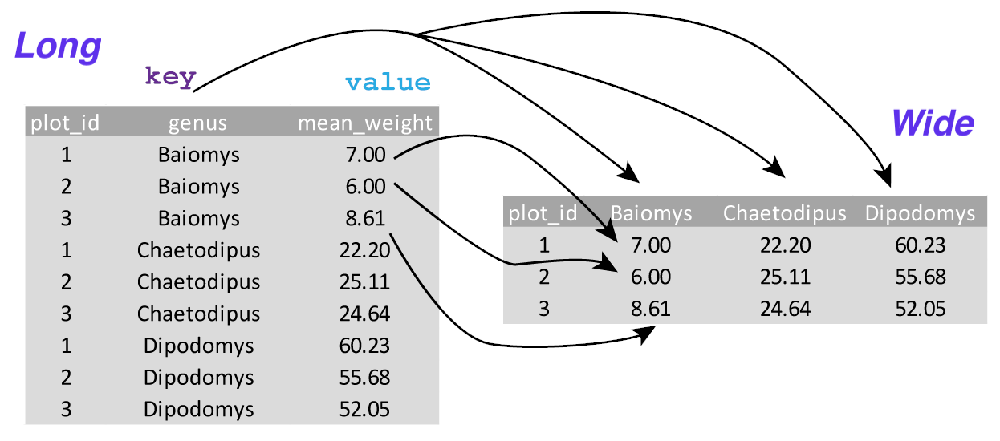

<head>
<script src="https://kit.fontawesome.com/ece750edd7.js" crossorigin="anonymous"></script>
</head>

```{r global_options, include=FALSE}
knitr::opts_chunk$set(warning=FALSE, message=FALSE)
```

----

##
<div class="objectives">
<h2><i class="far fa-check-square"></i> Learning Objectives</h2>
* Import data into a tidy structure
* Format, filter and manipulate your datasets in preparation for plotting 
* Understand the reason and methods for long and wide data formats
</div>
<br>

The **dplyr** package is specifically designed for data formatting and manipulation and allows you to merge datasets and create new columns as well as filtering and summarising your data. We are going to learn some of the most common functions.

<br>

## Selecting columns and filtering rows
***

First, make sure the tidyverse package is loaded and you have read in the `surveys` dataset.

```{r results='hidden'}
library(tidyverse)
surveys <- read_csv("http://bifx-core.bio.ed.ac.uk/training/R_dplyr_and_ggplot2/data/surveys_complete.csv")
```

To select columns of a dataframe, use `select()`. The first argument to this function is the data frame `surveys`, and the subsequent arguments are the columns to keep.

```{r eval=F, purl = FALSE}
select(surveys, plot_id, species_id, weight)
```

To drop columns from a dataframe, put a "-" in front of the variable to exclude it.

```{r eval=F, purl = FALSE}
select(surveys, -record_id, -species_id)
```

This will select all the variables in `surveys` except `record_id` and `species_id`.

To choose rows based on specific criteria, use `filter()`:

```{r eval=F, purl = FALSE}
filter(surveys, year == 1995)
```

<br>

## Pipes
***

What if you want to select and filter at the same time? There are three ways to do this:

* Intermediate objects
* Nested functions
* Pipes

With intermediate objects, you create a temporary dataframe and use that as input to the next function, like this:

```{r, eval=F, purl = FALSE}
surveys2 <- filter(surveys, weight < 5)
surveys_sml <- select(surveys2, species_id, sex, weight)
```

This is readable, but can clutter up your workspace with lots of objects that you have to name individually and keep track of.

You can also *nest* functions (i.e. one function inside of another), like this:

```{r, eval=F, purl = FALSE}
surveys_sml <- select(filter(surveys, weight < 5), species_id, sex, weight)
```

This is handy, but can be difficult to read if too many functions are nested. R evaluates the expression from the inside out (in this case, filtering, then selecting).

The alternative is to use *pipes*. Pipes let you take the output of one function and send it directly to the next, which is useful when you need to do many things to the same dataset. Pipes in R look like `%>%` and are made available via the **magrittr** package, installed automatically with **dplyr**. If you use RStudio, the keyboard shortcut for a pipe is <kbd>Ctrl</kbd> + <kbd>Shift</kbd> + <kbd>M</kbd>.

```{r, eval=F, purl = FALSE}
surveys %>%
  filter(weight < 5) %>%
  select(species_id, sex, weight)
```

Here we are 'piping' the `surveys` dataset through the `filter()` function, then through `select()`. Since `%>%` takes the object on its left and passes it as the first argument to the function on its right, we don't need to explicitly include the dataframe as an argument to the `filter()` and `select()` functions any more.

Some may find it helpful to read the pipe like the word "then". For instance, in the above example, we took the data frame `surveys`, *then* we `filter`ed for rows with `weight < 5`, *then* we `select`ed columns `species_id`, `sex`, and `weight`. The **dplyr** functions by themselves are somewhat simple, but by combining them into linear workflows with the pipe, we can accomplish more complex manipulations of data frames.

If we want to create a new object with this smaller version of the data, we can assign it a new name:

```{r, results = 'hide', purl = FALSE}
surveys_sml <- surveys %>%
  filter(weight < 5) %>%
  select(species_id, sex, weight)
surveys_sml
```

Note that the final data frame is the leftmost part of this expression.

<br>
<div class="challenge">
<h2><i class="fas fa-pencil-alt"></i> Challenge:</h2>
Using pipes, subset the `surveys` data to include animals collected before 1995 and retain only the columns `year`, `sex`, and `weight`.
<details>
<summary></summary>
<div class="solution">
<h2><i class="far fa-eye"></i> Solution:</h2>
```{r}
surveys %>%
  filter(year < 1995) %>%
  select(year, sex, weight)
```
</div>
</details>
</div>
<br>

## Exporting data
***

Similar to the `read_csv()` function there is also a `write_csv()` function. If you want to export any of your newly created datasets you can do this as follows:

```{r, eval=F}
##Create a data folder
dir.create("data")

write_csv(surveys_sml, file = "data/surveys_small.csv")
#Or use write_tsv for tab separated files
```

<br>

## Mutate
***

Frequently, you'll want to create new columns based on the values in existing columns, for example to do unit conversions, or to combine values from two columns. For this we use `mutate()`.

To create a new column of weight in kg:

```{r, eval=F,purl = FALSE}
surveys %>%
  mutate(weight_kg = weight * 1000)
```

You can also create a second new column based on the first new column within the same call of `mutate()`:

```{r, eval=F, purl = FALSE}
surveys %>%
  mutate(weight_kg = weight * 1000,
         weight_lb = weight_kg * 2.2)
```

If you just want to see the first few rows, you can use a pipe to view the `head()` of the data. 

```{r, eval=F,purl = FALSE}
surveys %>%
  mutate(weight_kg = weight / 1000) %>%
  head()
```

<br>
<div class="challenge">
<h2><i class="fas fa-pencil-alt"></i> Challenge:</h2>
Create a new data frame from the `surveys` data that meets the following criteria: Contains only the `species_id` column and a new column called `hindfoot_cm` containing the `hindfoot_length` values converted to centimeters. In this `hindfoot_cm` column all values are less than 3.

**Hint**: think about how the commands should be ordered to produce this data frame!
<details>
<summary></summary>
<div class="solution">
<h2><i class="far fa-eye"></i> Solution:</h2>
```{r}
surveys_hindfoot_cm <- surveys %>%
    mutate(hindfoot_cm = hindfoot_length / 10) %>%
    filter(hindfoot_cm < 3) %>%
    select(species_id, hindfoot_cm)
```
</div>
</details>
</div>
<br>

## Group_by and summarise 
***

Many data analysis tasks can be approached using the *split-apply-combine* paradigm: split the data into groups, apply some analysis to each group, and then combine the results. **dplyr** makes this very easy through the use of the `group_by()` function.

`group_by()` is often used together with `summarise()`, which collapses each group into a single-row summary of that group. The `group_by()` function takes as arguments the column names that contain the **categorical** variables for which you want to calculate the summary statistics. The `summarise()` function computes a summary statistic for each group using a specified function and variable. So to compute the mean `weight` by sex:

```{r, eval=F, purl = FALSE}
surveys %>%
  group_by(sex) %>%
  summarise(mean_weight = mean(weight))
```

You can also group by multiple columns:

```{r, eval=F,purl = FALSE}
surveys %>%
  group_by(sex, species_id) %>%
  summarise(mean_weight = mean(weight))
```

Once the data are grouped, you can create multiple summary columns at the same time. For instance, we could add columns indicating the minimum weight and mean hindfoot length for each species for each sex:

```{r, eval = F, purl = FALSE}
surveys %>%
  group_by(sex, species_id) %>%
  summarise(min_weight = min(weight),
            mean_hindfoot_length = mean(hindfoot_length))
```

It is sometimes useful to rearrange the result of a query to inspect the values. For instance, we can sort on `min_weight` to put the lighter species first and :

```{r, eval = F, purl = FALSE}
surveys %>%
  group_by(sex, species_id) %>%
  summarise(min_weight = min(weight),
            mean_hindfoot_length = mean(hindfoot_length)) %>%
  arrange(min_weight)
```

To sort in descending order, we need to add the `desc()` function. If we want to sort the results by decreasing order of mean weight:

```{r, eval = F, purl = FALSE}
surveys %>%
  group_by(sex, species_id) %>%
  summarise(min_weight = min(weight),
            mean_hindfoot_length = mean(hindfoot_length)) %>%
  arrange(desc(min_weight))
```

<br>

## Count
***

When working with data, we often want to know the number of observations found for each factor or combination of factors. For this task, **dplyr** provides `count()`. For example, if we wanted to count the number of rows of data for each sex, we would do:

```{r, eval = F, purl = FALSE}
surveys %>%
    count(sex) 
```

The `count()` function is shorthand for something we've already seen: grouping by a variable, and summarising it by counting the number of observations in that group. In other words, `surveys %>% count(sex)` is equivalent to:  

```{r, eval = F, purl = FALSE}
surveys %>%
    group_by(sex) %>%
    summarise(count = n()) #n() counts the size of each group
```

If we wanted to count a *combination of factors*, such as `sex` and `species`, we would specify the first and the second factor as the arguments of `count()`:

```{r eval = F, purl = FALSE}
surveys %>%
  count(sex, species) 
```

With the above code, we can proceed with `arrange()` to sort the table according to a number of criteria so that we have a better comparison. For instance, we might want to arrange the table above in (i) an alphabetical order of the levels of the species and (ii) in descending order of the count:

```{r eval = F, purl = FALSE}
surveys %>%
  count(sex, species) %>%
  arrange(species, desc(n))
```

<br>
<div class="challenge">
<h2><i class="fas fa-pencil-alt"></i> Challenge:</h2>
How many animals were caught in each `plot_type` surveyed?
<details>
<summary></summary>
<div class="solution">
<h2><i class="far fa-eye"></i> Solution:</h2>
```{r, eval = F,  purl=FALSE}
surveys %>%
    count(plot_type) 
```
</div>
</details>
Use `group_by()` and `summarise()` to find the mean, min, and max hindfoot length for each species (using `species_id`). Also add the number of observations (hint: see `?n`).
<details>
<summary></summary>
<div class="solution">
<h2><i class="far fa-eye"></i> Solution:</h2>
```{r, eval = F,  purl=FALSE}
surveys %>%
   group_by(species_id) %>%
   summarise(
       mean_hindfoot_length = mean(hindfoot_length),
       min_hindfoot_length = min(hindfoot_length),
       max_hindfoot_length = max(hindfoot_length),
       n = n())
```
</div>
</details>
 What was the heaviest animal measured in each year? Return the columns `year`, `genus`, `species_id`, and `weight`. Order the output by `year`.
<details>
<summary></summary>
<div class="solution">
<h2><i class="far fa-eye"></i> Solution:</h2>
```{r, eval = F,  purl=FALSE}
surveys %>%
   group_by(year) %>%
   filter(weight == max(weight)) %>%
   select(year, genus, species, weight) %>%
   arrange(year)
```
</div>
</details>
</div>
<br>

<br>
<div class="discussion">
<h2><i class="far fa-bell"></i> Discussion</h2>
* Look at the `surveys` dataset with the `print()` function. How many rows and columns does it have?
* By default, tibbles hide a lot of the data to prevent the screen from getting crowded. How can you show more rows and all of the columns? 
* What other questions can we ask of this dataset? Set a challenge for a partner or your group using the dplyr functions.
</div>
<br>

## Pivoting functions in tidyr
***

The **tidyr** package contains the functions `pivot_longer()` and `pivot_wider()` which allow you to transform a dataset between *long* and *wide* formats. For instance, what if we wanted to compare the mean weights of each species at each plot (using plot_id). 

We'd need to create a new table where each row is comprised of values of variables associated with each plot. In practical terms this means the values in `genus` would become the names of column variables and the cells would contain the values of the mean weight observed on each plot.



Having created a new table, it is then straightforward to explore the relationship between the weight of different genera within, and between, the plots. The key point here is that we are still following a tidy data structure,but we have **reshaped** the data according to the observation of interest. Mean genus weight per plot, instead of recordings per date.

First, lets create `surveys_gw` where observations for each plot (genus and mean_weight) are spread across multiple rows: 

```{r, results="hide",purl=FALSE}
surveys_gw <- surveys %>%
  group_by(plot_id, genus) %>%
  summarise(mean_weight = mean(weight))
```

Using `pivot_wider()` with `genus` as the names of the new columns and `mean_weight` as the values, we can create a table that allows us to compare mean weights of different genera at each plot. 

```{r, eval=F, purl=FALSE}
surveys_wide <- surveys_gw %>%
  pivot_wider(names_from = genus,values_from = mean_weight)
```

The opposing situation could occur if we had been provided with data in the form of `surveys_wide`, where the genus names are column names, but we wish to treat them as values of a variable instead. To do this we can use the `pivot_longer()` function.

<br>
<div class="resources">
<h2><i class="fas fa-book"></i> Further Learning</h2>
Examples of more dplyr functions are available on the  [dplyr](https://dplyr.tidyverse.org/) website.
</div>
<br>

<div class="key-points">
<h2><i class="fas fa-thumbtack"></i> Key points</h2>
 * Import and format data with `readr` and `tidyr`.
 * Use dplyr `select`, `filter` and `mutate` to manipulate datasets
 * Use `group_by`, `summarise` and `count` to create summary datasets by groups.
 * Use `pivot_longer` and `pivot_wider` to move between wide and long formats.
</div>
<br>
